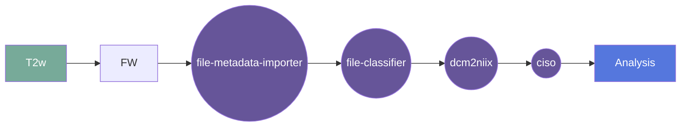

# Hyperfine - Construction of isotropic image from tri-plane othogonal aquisitions

## Overview

[Usage](#usage)

[FAQ](#faq)

### Summary
Takes three orthogonally acquired images (axial, coronal, sagittal) collected on Hyperfine Swoop and combines into a single 1.5mm isotropic image. 

Inputs: 
-	Axial
-	Coronal
-	Sagittal
-	Template (age-matched) [now optional]

If no age matched template is provided, the algorithm will attempt to first make an initial template by rigid regisitration of all images to the axial plane.
This will then be the reference for isotropic reconstruction.

There is now also a feature in the configuration to select if a phantom is being reconstructed. 

### Cite

**license:**

**url:** <https://gitlab.com/flywheel-io/flywheel-apps/>

**cite:** 

### Classification

*Category:* analysis

*Gear Level:*

* [ ] Project
* [x] Subject
* [x] Session
* [ ] Acquisition
* [ ] Analysis

----

### Inputs

* api-key
  * **Name**: api-key
  * **Type**: object
  * **Optional**: true
  * **Classification**: api-key
  * **Description**: Flywheel API key.

* axi
  * **Name**: sxi
  * **Type**: file
  * **Optional**: false
  * **Classification**: file
  * **Description**: Axial plane acquisition
  
* sag
  * **Name**: sag
  * **Type**: file
  * **Optional**: false
  * **Classification**: file
  * **Description**: Sagital plane acquisition
  
* cor
  * **Name**: cor
  * **Type**: file
  * **Optional**: false
  * **Classification**: file
  * **Description**: Coronal plane acquisition
        }

### Config

* template
  * **Name**: template
  * **Type**: string
  * **Description**: Volume template space (default: MNI152NLin2009cAsym)
  * **Optional**: true

### Outputs
Isotropic volume

#### Metadata

No metadata currently created by this gear

### Pre-requisites

- Three orthogonal aquisitions
- Age of participant (for age matched template)

#### Prerequisite Gear Runs

This gear runs on BIDS-organized data. To have your data BIDS-ified, it is recommended
that you run, in the following order:

1. ***dcm2niix***
    * Level: Any
2. ***file-metadata-importer***
    * Level: Any
3. ***file-classifier***
    * Level: Any

#### Prerequisite

## Usage

This section provides a more detailed description of the gear, including not just WHAT
it does, but HOW it works in flywheel

### Description

This gear is run at either the `Subject` or the `Session` level. It downloads the data
for that subject/session into the `/flwyhweel/v0/work/bids` folder and then runs the
`ciso` pipeline on it.

After the pipeline is run, the output folder is zipped and saved into the analysis
container.

#### File Specifications

This section contains specifications on any input files that the gear may need

### Workflow

A picture and description of the workflow

Description of workflow

1. Upload data to container
2. Prepare data by running the following gears:
   1. file metadata importer
   2. file classifier
   3. dcm2niix
   4. MRIQC (optional)
3. Select either a subject or a session.
4. Run the ciso gear
5. Gear places output in Analysis

### Use Cases

## FAQ

[FAQ.md](FAQ.md)

## Contributing

[For more information about how to get started contributing to that gear,
checkout [CONTRIBUTING.md](CONTRIBUTING.md).]
