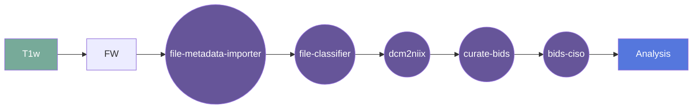

# Hyperfine Multi single plane aquisition to isotropic image Gear

This gear runs ... on
[BIDS-curated data](https://bids.neuroimaging.io/).

## Overview

[Usage](#usage)

[FAQ](#faq)

### Summary

### Cite

**license:**

**url:** <https://gitlab.com/flywheel-io/flywheel-apps/>

**cite:** 

### Classification

*Category:* analysis

*Gear Level:*

* [ ] Project
* [x] Subject
* [x] Session
* [ ] Acquisition
* [ ] Analysis

----

[[*TOC*]]

----

### Inputs

* bidsignore
  * **Name**: bidsignore
  * **Type**: object
  * **Optional**: true
  * **Classification**: file
  * **Description**: A .bidsignore file to provide to the bids-validator that this gear
runs before running the main command.

* api-key
  * **Name**: api-key
  * **Type**: object
  * **Optional**: true
  * **Classification**: api-key
  * **Description**: Flywheel API key.

### Config

* debug
  * **Name**: debug
  * **Type**: boolean
  * **Description**: Log debug messages
  * **Default**: false

* bids_app_args
  * **Name**: bids_app_args
  * **Type**: string
  * **Description**: Extra arguments to pass to the BIDS App, space-separated:
`[arg1 [arg2 ...]]`
  * **Default**: "" (empty)

* interactive-reports-only
  * **Name**: interactive-reports-only
  * **Type**: boolean
  * **Description**: create interactive report json files on already preprocessed data.
  * **Optional**: true

* acquisition_type
  * **Name**: acquisition_type
  * **Type**: string
  * **Description**: select a specific acquisition type to be processed.
  * **Optional**: true

* infant
  * **Name**: infant
  * **Type**: boolean
  * **Description**: configure pipelines to process infant brains.
  * **Optional**: true

* boilerplate
  * **Name**: boilerplate
  * **Type**: boolean
  * **Description**: generate boilerplate only.
  * **Optional**: true

* template
  * **Name**: template
  * **Type**: string
  * **Description**: Volume template space (default: MNI152NLin2009cAsym)
  * **Optional**: true

* output-resolution
  * **Name**: output-resolution
  * **Type**: number
  * **Description**: the isotropic voxel size in mm the data will be resampled to after
preprocessing. If set to a lower value than the original voxel size, your data will be
upsampled using BSpline interpolation.
  * **Optional**: true

* intramodal-template-iters
  * **Name**: intramodal-template-iters
  * **Type**: integer
  * **Description**: Number of iterations for finding the midpoint image from the b0
templates from all groups. Has no effect if there is only one group. If 0, all b0
templates are directly registered to the t1w image.
  * **Optional**: true

* hmc-transform
  * **Name**: hmc-transform
  * **Type**: string
  * **Description**: transformation to be optimized during head motion correction
(default: affine).
  * **Optional**: true

* skull-strip-template
  * **Name**: skull-strip-template
  * **Type**: string
  * **Description**: select ANTs skull-stripping template (default: OASIS)
  * **Optional**: true

* skull-strip-fixed-seed
  * **Name**: skull-strip-fixed-seed
  * **Type**: string
  * **Description**: do not use a random seed for skull-stripping - will ensure
run-to-run replicability when used with -omp-nthreads 1
  * **Optional**: true

* skip-t1-based-spatial-normalization
  * **Name**: skip-t1-based-spatial-normalization
  * **Type**: boolean
  * **Description**: skip running the t1w-based normalization to template space.
Default is to run the normalization.
  * **Optional**: true

* reports-only
  * **Name**: reports-only
  * **Type**: boolean
  * **Description**: only generate reports, don't run workflows. This will only rerun
report aggregation, not reportlet generation for specific nodes.
  * **Optional**: true

* verbose
  * **Name**: verbose
  * **Type**: string
  * **Description**: increases log verbosity for each occurrence, debug level is `-vvv`
  * **Optional**: true

* n_cpus
  * **Name**: n_cpus
  * **Type**: integer
  * **Description**: Number of CPUs/cores to use. Leave blank or set to `0` to use the
maximum available in the system.
  * **Optional**: true

* mem_mb
  * **Name**: mem_mb
  * **Type**: integer
  * **Description**: Maximum memory to use (MB). Leave blank or set to 0 to use the
maximum available in the system.
  * **Optional**: true

* write-graph
  * **Name**: write-graph
  * **Type**: boolean
  * **Description**: Write workflow graph.
  * **Optional**: true

* ignore
  * **Name**: ignore
  * **Type**: string
  * **Description**: Ignore selected aspects of the input dataset to disable
corresponding parts of the workflow (a space delimited list)  Possible choices:
`fieldmaps`, `slicetiming`, `sbref`.
  * **Optional**: true

* gear-ignore-bids-errors
  * **Name**: gear-ignore-bids-errors
  * **Type**: boolean
  * **Description**: By default, the gear will not run if there are any BIDS errors
detected. Set this to run even if BIDS errors are detected.
  * **Optional**: true

* gear-run-bids-validation
  * **Name**: gear-run-bids-validation
  * **Type**: boolean
  * **Description**: Gear will run BIDS validation after downloading data.  If
validation fails `ciso` will NOT be run.
  * **Optional**: true

* gear-save-intermediate-output
  * **Name**: gear-save-intermediate-output
  * **Type**: boolean
  * **Description**: Gear will save ALL intermediate output into `ciso_work.zip`.
  * **Optional**: true

* gear-intermediate-files
  * **Name**: gear-intermediate-files
  * **Type**: string
  * **Description**: Space separated list of FILES to retain from the intermediate work
directory.
  * **Optional**: true

* gear-intermediate-folders
  * **Name**: gear-intermediate-folders
  * **Type**: boolean
  * **Description**: Space separated list of FOLDERS to retain from the intermediate work
directory.
  * **Optional**: true

* gear-dry-run
  * **Name**: gear-dry-run
  * **Type**: boolean
  * **Description**: Do everything except actually executing `ciso`.
  * **Optional**: true

* gear-keep-output
  * **Name**: gear-keep-output
  * **Type**: boolean
  * **Description**: Don't delete output.  Output is always zipped into a single file
for easy download.  Choose this option to prevent output deletion after zipping.
  * **Optional**: true

### Outputs

#### Metadata

Any notes on metadata created by this gear

### Pre-requisites

This section contains any prerequisites

#### Prerequisite Gear Runs

This gear runs on BIDS-organized data. To have your data BIDS-ified, it is recommended
that you run, in the following order:

1. ***dcm2niix***
    * Level: Any
2. ***file-metadata-importer***
    * Level: Any
3. ***file-classifier***
    * Level: Any

#### Prerequisite

This BIDS-App runs FreeSurfer, so you need to provide a valid FreeSurfer license.

Supported ways to provide the license are documented [here](
https://docs.flywheel.io/hc/en-us/articles/360013235453)

## Usage

This section provides a more detailed description of the gear, including not just WHAT
it does, but HOW it works in flywheel

### Description

This gear is run at either the `Subject` or the `Session` level. It downloads the data
for that subject/session into the `/flwyhweel/v0/work/bids` folder and then runs the
`ciso` pipeline on it.

After the pipeline is run, the output folder is zipped and saved into the analysis
container.

#### File Specifications

This section contains specifications on any input files that the gear may need

### Workflow

A picture and description of the workflow

Description of workflow

1. Upload data to container
2. Prepare data by running the following gears:
   1. file metadata importer
   2. file classifier
   3. dcm2niix
   4. MRIQC (optional)
   5. curate bids
3. Select either a subject or a session.
4. Run the bids-ciso gear
5. Gear places output in Analysis

### Use Cases

## FAQ

[FAQ.md](FAQ.md)

## Contributing

[For more information about how to get started contributing to that gear,
checkout [CONTRIBUTING.md](CONTRIBUTING.md).]
